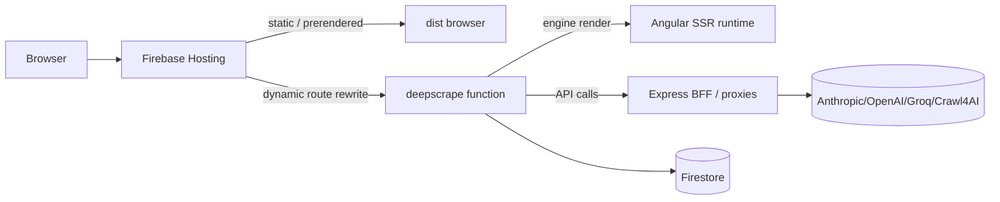

<div align="center">

# 🕷️ deepscrape

### The AI‑powered web scraping & crawl‑orchestration API for AI agents 🤖

> The web rains raw pages. **deepscrape** catches them — and hands your agents
> clean, structured, AI‑ready data. No‑code crawls, real‑browser rendering,
> anti‑bot handling, and answers your AI can actually use.

[](LICENSE)
[](https://angular.dev)
[](https://www.typescriptlang.org)
[](https://bun.sh)
[](https://firebase.google.com)
[](https://angular.dev/guide/hydration)

**Live site:** [deepscrape.dev](https://deepscrape.dev) · **Repo:** [deepscrape/deepscrape](https://github.com/deepscrape/deepscrape)

</div>

## Table of Contents

- [🕷️ deepscrape](#️-deepscrape)
    - [The AI‑powered web scraping \& crawl‑orchestration API for AI agents 🤖](#the-aipowered-web-scraping--crawlorchestration-api-for-ai-agents-)
  - [Table of Contents](#table-of-contents)
  - [📸 Product preview](#-product-preview)
  - [🤔 What is deepscrape?](#-what-is-deepscrape)
  - [✨ Highlights](#-highlights)
  - [🧩 What it does for you](#-what-it-does-for-you)
  - [🧱 Tech stack](#-tech-stack)
  - [🏗️ Architecture](#️-architecture)
    - [Repository layout](#repository-layout)
    - [Request lifecycle (SSR)](#request-lifecycle-ssr)
    - [Functions domain map](#functions-domain-map)
  - [⚡ Prerequisites](#-prerequisites)
  - [🚀 Getting started](#-getting-started)
  - [🌍 Environment variables](#-environment-variables)
    - [Root `.env` (app)](#root-env-app)
    - [`functions/.env.local` (backend)](#functionsenvlocal-backend)
  - [🧰 Available scripts](#-available-scripts)
    - [App (root)](#app-root)
    - [Functions (`functions/`)](#functions-functions)
  - [🧪 Testing](#-testing)
  - [🚢 Deployment](#-deployment)
  - [🛟 Troubleshooting](#-troubleshooting)
  - [🤝 Contributing](#-contributing)
  - [📄 License](#-license)

---

## 📸 Product preview

<p align="center">
  
  <br><sub>🦾 Web data at lightning speed — the scraping API for AI agents.</sub>
</p>

<p align="center">
  
  <br><sub>🔎 A live research agent that browses the web and answers with structured data.</sub>
</p>

---

## 🤔 What is deepscrape?

**deepscrape** is what runs on [deepscrape.dev](https://deepscrape.dev) — a complete
**web‑extraction platform**, not just a scraper. Point it at any site and it:

1. 🖥️ **Renders the page like a real browser** — handles JavaScript‑heavy SPAs.
2. 🛡️ **Defeats proxies & bot protection** — rotates proxies and navigates anti‑bot walls.
3. 🧹 **Extracts clean, structured data** — messy HTML becomes the fields, rows and JSON you want.
4. 🤖 **Hands it to the AI you prefer** — Claude, GPT, Groq, Google, Jina, Fireworks, OpenRouter, Crawl4AI and any OpenAI‑compatible endpoint.

**This repository** is the full source: the Angular app, the SSR server that renders
it, the API layer that talks to AI + crawl providers, and the Firebase backend.

---

## ✨ Highlights

| 🕸️ Crawl orchestration | 🔎 Live research agent | 🤖 Multi‑AI extraction |
| --- | --- | --- |
| Configs, browser profiles, extraction strategies, operations & schedulers | A browser‑capable agent (MCP‑native) that searches, navigates & answers | Anthropic, OpenAI, Groq, Google, Jina, Crawl4AI & more |

| ⚙️ CrawlPack machines | 👤 Full accounts | 💳 Stripe billing |
| --- | --- | --- |
| Deploy & manage your own crawlers | Login, signup, verification, password reset, sessions | Plans, credit passes, usage‑based controls |

| 📊 Admin workspace | 🌍 International | 🚀 SSR + PWA |
| --- | --- | --- |
| Analytics, migrations, backups, run history | English + ES, FR, DE locales (@ngx-translate) | Prerendered static routes + incremental hydration |

---

## 🧩 What it does for you

- **Scrapes the hard stuff** 🪨 — real browser rendering, proxy rotation and anti‑bot handling, so pages that block plain HTTP clients still come through.
- **Extracts clean data** 🧼 — structured extraction turns messy HTML into the fields, rows and JSON you actually want.
- **Works with any AI** 🔌 — a multi‑provider platform. Route scraping results to **Anthropic (Claude), OpenAI (GPT), Groq, Google, Jina, Fireworks, OpenRouter, Crawl4AI** — or any OpenAI‑compatible endpoint. No lock‑in.
- **Answers, not just pages** 💬 — ask in plain language and a live research agent searches, navigates and reads for you, returning structured answers to your dashboard.
- **Your infrastructure, your way** 🏗️ — deploy your own crawls with CrawlPack machines, watch everything from the dashboard, and manage billing, plans and API keys in one place.
- **Fast & reliable by default** ⚡ — Angular 20 zoneless + SSR with incremental hydration, lazy routes, and prerendered marketing pages for instant first paint and SEO.

---

## 🧱 Tech stack

| Layer | Technology |
| --- | --- |
| **Frontend** | Angular 20 (standalone, **zoneless**, SSR/PWA) · Angular Material · TailwindCSS v3 + `tailwindcss-motion` |
| **SSR** | `@angular/ssr` — Express (default) or **Elysia** (`--configuration=elysia`) |
| **Package manager** | **Bun** (root) · npm (functions) |
| **Auth** | Firebase Auth (`@angular/fire`) · AppCheck (ReCaptcha v3) |
| **Database** | Firestore |
| **Backend (BFF)** | Firebase Functions (Gen2, Node 22, Express) — and Elysia (`api/`) |
| **Payments** | Stripe (`ngx-stripe`) |
| **Rate limiting** | Upstash Redis + `@upstash/ratelimit` |
| **State** | RxJS `BehaviorSubject` (shared) · Angular Signals (local) |
| **i18n** | `@ngx-translate/core` (EN, ES, FR, DE) |
| **Charts** | chart.js + ng2-charts |
| **Markdown** | ngx-markdown + prismjs |
| **AI / crawl providers** | Anthropic · OpenAI · Groq · Google · Jina · Fireworks · OpenRouter · Crawl4AI |
| **Env management** | `dotenvx` (encrypted) — `environment.ts` is generated |
| **Release** | `semantic-release` + conventional commits (`git cz`) |

---

## 🏗️ Architecture

### Repository layout

```
deepscrape/
├── src/app/                  # Angular app (standalone, zoneless)
│   ├── routes/               # main · service · user route files (lazy)
│   ├── pages/                # home, landpage, admin, billing, user…
│   ├── layout/               # chrome, landpage sections (hero, code-demo…)
│   └── core/                 # services, guards, shared components
├── functions/                # Firebase backend (BFF + ~60 functions)
│   └── src/
│       ├── app/              # Express app, auth, stripe
│       ├── config/           # Firebase / env / secret config
│       ├── domain/           # business logic (billing, analytics, global)
│       ├── gfunctions/       # callable & scheduled functions
│       ├── handlers/         # route handlers
│       ├── infrastructure/   # external clients
│       ├── index.ts          # function exports
│       └── server.ts         # Express BFF (deepscrape onRequest)
├── api/                      # Elysia SyncAI API
├── public/                   # static hosting assets (icons, 404…)
├── src/styles.scss           # global design tokens / Tailwind
└── angular.json · firebase.json · package.json
```

### Request lifecycle (SSR)



- **Prerendered routes** (marketing pages) ship full static HTML from Hosting.
- **Dynamic routes** (`admin/**`, `settings/**`, …) are engine‑rendered at request time by the `deepscrape` function via `@angular/ssr` (`CommonEngine`) when the SSR runtime is packaged — with a graceful CSR fallback. Disable with `DEEPSCRAPE_DYNAMIC_SSR=false`.
- **Hydration** uses incremental hydration + event replay for fast, interactive first paint.

### Functions domain map

Business logic lives in `domain/`, entry points in `gfunctions/`, and only entry points are exported from `functions/src/index.ts`. New functions follow: `gfunctions/<name>.ts` → export in `index.ts` → business logic in `domain/<domain>/`.

---

## ⚡ Prerequisites

- **Bun** (recommended) or **Node.js 20+**
- **Firebase CLI** (`firebase-tools`)
- **npm** (for `functions/`)
- A Firebase project + (for live features) Stripe, Upstash Redis, and AI‑provider API keys
- Java (only for local Firebase **Firestore** emulator on some OSes)

---

## 🚀 Getting started

```bash
# 1. Clone
git clone https://github.com/deepscrape/deepscrape.git
cd deepscrape

# 2. Install dependencies (Bun for the app, npm for functions)
bun install
cd functions && npm install && cd ..

# 3. Configure environment (dotenvx — .env files are NOT committed)
cp .env.example .env                  # add your keys
cp functions/.env.example functions/.env.local

# 4. Generate environment.ts + start the dev server
bun run prbuild
bun run dev
```

Open [http://localhost:4200](http://localhost:4200) 🎉

Want the full stack (auth, Firestore, hosting) locally with Firebase emulators?

```bash
bun run serve
```

Production build & deploy:

```bash
bun run build     # production build (prerenders static routes)
bun run deploy    # build + deploy hosting & functions
```

> 💡 `src/environments/environment.ts` is **generated** — never hand‑edit it.
> Change `.env` / `prod_gen.ts`, then run `bun run prebuild`.

---

## 🌍 Environment variables

### Root `.env` (app)

| Variable | Description |
| --- | --- |
| `API_KEY`, `AUTH_DOMAIN`, `DATABASE_URL`, `PROJECT_ID` | Firebase config |
| `STORAGE_BUCKET`, `MESSAGING_SENDER_ID`, `APP_ID` | Firebase config |
| `MEASUREMENT_ID` | GA4 analytics |
| `RECAPTCHA_KEY` | AppCheck ReCaptcha v3 |
| `STRIPE_PUBLIC_KEY` | Stripe publishable key |
| `ANTHROPIC_API_KEY`, `OPENAI_API_KEY`, `GROQ_API_KEY`, `GOOGLE_API_KEY`, `JINAAI_API_KEY` | AI providers |
| `UPSTASH_REDIS_REST_URL/PORT/USER/PASSWORD/TOKEN` | Rate limiting |
| `GCP_PROJECT_ID`, `PRODUCTION`, `EMULATORS`, `PORT` | Build / runtime flags |

### `functions/.env.local` (backend)

| Variable | Description |
| --- | --- |
| `ADMIN_EMAILS` | Bootstrap admin emails |
| `API_CRAWL4AI_URL`, `API_ARACHNEFLY_URL` | Crawl provider endpoints |
| `UPSTASH_REDIS_*` | Rate limiting / caching |
| `FUNCTIONS_ENV_JSON` | 🔐 Stored as a **Secret Manager** secret (`FUNCTIONS_ENV_JSON`) and read by functions via `defineJsonSecret` |

> 🔒 Secrets are **never committed**. Keep them in dotenv files locally and in
> **Google Secret Manager** for production function deploys.

---

## 🧰 Available scripts

### App (root)

| Command | What it does |
| --- | --- |
| `bun run dev` | Dev server (proxied) |
| `bun run build` | Production build (prerender 48 static routes) |
| `bun run build:staging` | Staging build |
| `bun run serve` | Dev build + Firebase emulators |
| `bun run deploy` | Build + deploy hosting & functions |
| `bun run test` / `test:ci` | Unit tests (headless in CI) |
| `bun run prebuild` | Regenerate `environment.ts` from `.env` |
| `bun run node:ssr:deepscrape` / `bun:ssr:deepscrape` | Run the production SSR server locally |
| `git cz` | Conventional‑commit prompt (required for commits) |

### Functions (`functions/`)

| Command | What it does |
| --- | --- |
| `npm run build` | `cp-angular.js` (package Angular SSR runtime) + `tsc` |
| `npm run serve` | Firebase emulators (functions, hosting, pubsub, …) |
| `npm run lint` | ESLint over functions |
| `npm run deploy` | Deploy with JSON config |
| `npm run test` | TS tests (`tsx --test`) |

---

## 🧪 Testing

```bash
bun run test       # app unit tests (Karma/Jasmine)
bun run test:ci    # headless CI run
cd functions && npm run test   # backend tests (tsx)
```

Tests live next to their code (`*.spec.ts`). CI runs the app suite headless and
lints functions before every deploy.

---

## 🚢 Deployment

**Stack:** Firebase Hosting (static + prerendered app) · Cloud Run BFF (Bun + Elysia, `bff/`) · Firebase Functions Gen2 (callables + triggers, Node 22) · Secret Manager · CI via GitHub Actions.

```bash
# Full release: web build → hosting → BFF image → Cloud Run
make bff-release

# Or step by step
bun run build                          # prerenders static routes + service worker
firebase deploy --only hosting          # static/prerendered app; rewrites ** to the BFF
cd bff && bun run deploy:cloud          # build, push and deploy the BFF image
firebase deploy --only functions        # callables + Firestore/Auth/PubSub triggers
```

Hosting rewrites every path with no static file behind it to the Cloud Run service
`deepscrape-bff`, which serves the CSR shell and the `/api`, `/oauth`, `/event`,
`/status`, `/services/contact` routes. The `deepscrape` HTTPS function is **not** in
the production path any more (both `deepscrape.dev` and `deepscrape.web.app` are the
same Hosting site); it is kept only so the Hosting emulator can reach the API locally
via `firebase.dev.json`.

**CI/CD** — GitHub Actions workflows:
- `firebase-hosting-merge.yml` → builds & deploys hosting + functions on merge to `main`/`next`.
- `firebase-hosting-pull-request.yml` → per‑PR hosting preview channels (like the staging previews) + functions analysis.
- `test.yml` → runs the Angular test suite.

**Release process** — `semantic-release` runs on push to `main`/`next`. It writes
`CHANGELOG.md`, bumps `package.json`, and opens a `chore/release-assets-*` PR.
Commit with `git cz` (commitlint enforces conventional commits).

> ⚠️ **Production function deploy requires billing enabled on the project** and the
> `FUNCTIONS_ENV_JSON` secret accessible in Secret Manager — otherwise the deploy
> fails with `403 requires billing`.

---

## 🛟 Troubleshooting

| Symptom | Fix |
| --- | --- |
| `auth/operation-not-supported-in-this-environment` during build | Non‑fatal SSR noise from a browser‑only Firebase Auth call while prerendering. Authenticated routes are excluded from prerender; guards still run client‑side. |
| `secretmanager…FUNCTIONS_ENV_JSON 403 requires billing` on deploy | Enable billing on the GCP project, verify the secret exists and the deploy SA has `roles/secretmanager.secretAccessor`. |
| Firebase **Firestore emulator** exits `0xC000013A` on Windows | Known Java/emulator crash — run `--only functions,hosting` to test SSR without Firestore. |
| Blank page after deploy (stale asset 404) | Hard‑refetch; the function 404s missing assets instead of serving `index.html`, so bump/clear the service worker cache. |
| `environment.ts` out of date | Run `bun run prebuild` after changing `.env`. |
| Port already in use (`5000`, `8081`) | Kill the leftover emulator process and retry. |
| Hydration `NG0500/NG0505` errors | Add `ngSkipHydration` only where truly needed; server & client must produce identical markup. |

---

## 🤝 Contributing

1. Branch from **`main`** (or target **`next`** for pre‑releases).
2. Commit with `git cz` — **conventional commits** (commitlint + husky enforce it).
3. Open a PR. CI runs tests, lint, and (on merge) semantic‑release:
   - `feat` → minor, `fix`/`perf`/`refactor` → patch, `BREAKING CHANGE:` → major.
4. Keep commit bodies ≤ 100 chars/line (commitlint).

**Code style:** Angular 20 standalone + zoneless + `inject()` + `OnPush`; lazy‑load every page route; never hand‑edit generated `environment.ts`.

---

## 📄 License

[MIT](LICENSE) © Deepscrape

---

<p align="center">Made with 🖤 · Fast, reliable AI web extraction — <a href="https://deepscrape.dev">deepscrape.dev</a></p>

