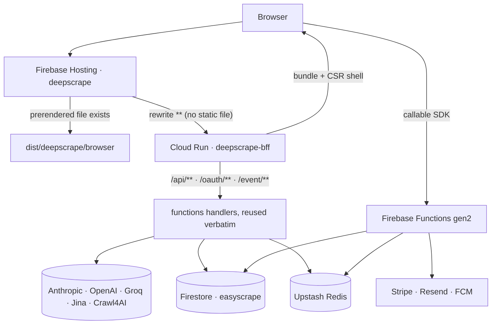
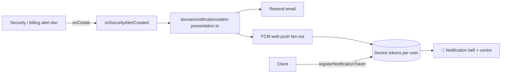

<div align="center">

# 🕷️ deepscrape

### The AI‑powered web scraping & crawl‑orchestration API for AI agents 🤖

> The web rains raw pages. **deepscrape** catches them — and hands your agents
> clean, structured, AI‑ready data. No‑code crawls, real‑browser rendering,
> anti‑bot handling, and answers your AI can actually use.

[](LICENSE)
[](https://angular.dev)
[](https://www.typescriptlang.org)
[](https://bun.sh)
[](https://elysiajs.com)
[](https://firebase.google.com)
[](https://angular.dev/guide/prerendering)

**Live site:** [deepscrape.dev](https://deepscrape.dev) · **Repo:** [deepscrape/deepscrape](https://github.com/deepscrape/deepscrape)

</div>

## Table of Contents

- [🕷️ deepscrape](#️-deepscrape)
- [📸 Product preview](#-product-preview)
- [🤔 What is deepscrape?](#-what-is-deepscrape)
- [✨ Highlights](#-highlights)
- [🧩 What it does for you](#-what-it-does-for-you)
- [🧱 Tech stack](#-tech-stack)
- [🏗️ Architecture](#️-architecture)
  - [Repository layout](#repository-layout)
  - [Request lifecycle](#request-lifecycle)
  - [The BFF (Bun + Elysia on Cloud Run)](#the-bff-bun--elysia-on-cloud-run)
  - [Backend functions](#backend-functions)
  - [Auth, sessions & authorization](#auth-sessions--authorization)
  - [Notifications](#notifications)
  - [Analytics & geo enrichment](#analytics--geo-enrichment)
  - [Billing (Stripe)](#billing-stripe)
  - [Data stores](#data-stores)
- [⚡ Prerequisites](#-prerequisites)
- [🚀 Getting started](#-getting-started)
- [🌍 Environment variables](#-environment-variables)
  - [Root `.env` (app)](#root-env-app)
  - [`functions/.env.local` (backend)](#functionsenvlocal-backend)
  - [Secret Manager (production)](#secret-manager-production)
- [🧰 Available scripts](#-available-scripts)
  - [App (root)](#app-root)
  - [Functions (`functions/`)](#functions-functions)
  - [BFF (`bff/`)](#bff-bff)
  - [Make targets](#make-targets)
- [🧪 Testing](#-testing)
- [🚢 Deployment](#-deployment)
  - [What runs where](#what-runs-where)
  - [The BFF image → Cloud Run](#the-bff-image--cloud-run)
  - [Hosting](#hosting)
  - [Functions](#functions)
  - [One‑command releases](#onecommand-releases)
  - [CI/CD workflows](#cicd-workflows)
  - [Release process](#release-process)
- [🛟 Troubleshooting](#-troubleshooting)
- [🤝 Contributing](#-contributing)
- [📚 Further reading](#-further-reading)
- [📄 License](#-license)

---

## 📸 Product preview

<p align="center">
  
  <br><sub>🦾 Web data at lightning speed — the scraping API for AI agents.</sub>
</p>

<p align="center">
  
  <br><sub>🔎 A live research agent that browses the web and answers with structured data.</sub>
</p>

---

## 🤔 What is deepscrape?

**deepscrape** is what runs on [deepscrape.dev](https://deepscrape.dev) — a complete
**web‑extraction platform**, not just a scraper. Point it at any site and it:

1. 🖥️ **Renders the page like a real browser** — handles JavaScript‑heavy SPAs.
2. 🛡️ **Defeats proxies & bot protection** — rotates proxies and navigates anti‑bot walls.
3. 🧹 **Extracts clean, structured data** — messy HTML becomes the fields, rows and JSON you want.
4. 🤖 **Hands it to the AI you prefer** — Claude, GPT, Groq, Google, Jina, Fireworks, OpenRouter, Crawl4AI and any OpenAI‑compatible endpoint.

**This repository** is the full source: the Angular app, the Bun + Elysia BFF that
serves it, the Firebase functions that back every feature, and the CI/CD that ships
all three.

---

## ✨ Highlights

| 🕸️ Crawl orchestration | 🔎 Live research agent | 🤖 Multi‑AI extraction |
| --- | --- | --- |
| Configs, browser profiles, extraction strategies, operations & schedulers | A browser‑capable agent (MCP‑native) that searches, navigates & answers | Anthropic, OpenAI, Groq, Google, Jina, Crawl4AI & more |

| ⚙️ CrawlPack machines | 👤 Full accounts | 💳 Stripe billing |
| --- | --- | --- |
| Deploy & manage your own crawlers | Login, signup, passkeys, TOTP, device trust, sessions | Plans, credit passes, usage‑based controls, tax‑inclusive prices |

| 🔔 Notifications | 📊 Admin workspace | 🌍 International |
| --- | --- | --- |
| Web push + email fan‑out for security alerts | Analytics, billing observability, migrations, run history | English + ES, FR, DE + EL locales (@ngx-translate) |

| 🚀 SSR + PWA | 🍪 Consent & privacy | 🧩 Typed end‑to‑end |
| --- | --- | --- |
| Prerendered public routes, CSR shell for app routes | Consent banner gating guest tracking | TypeScript everywhere — Angular, functions and the BFF |

---

## 🧩 What it does for you

- **Scrapes the hard stuff** 🪨 — real browser rendering, proxy rotation and anti‑bot handling, so pages that block plain HTTP clients still come through.
- **Extracts clean data** 🧼 — structured extraction turns messy HTML into the fields, rows and JSON you actually want.
- **Works with any AI** 🔌 — a multi‑provider platform. Route scraping results to **Anthropic (Claude), OpenAI (GPT), Groq, Google, Jina, Fireworks, OpenRouter, Crawl4AI** — or any OpenAI‑compatible endpoint. No lock‑in.
- **Answers, not just pages** 💬 — ask in plain language and a live research agent searches, navigates and reads for you, returning structured answers to your dashboard.
- **Your infrastructure, your way** 🏗️ — deploy your own crawls with CrawlPack machines, watch everything from the dashboard, and manage billing, plans and API keys in one place.
- **Fast & reliable by default** ⚡ — Angular 20 zoneless, prerendered marketing pages for instant first paint and SEO, a CSR shell for the authenticated app, and a Bun + Elysia BFF that serves both.

---

## 🧱 Tech stack

| Layer | Technology |
| --- | --- |
| **Frontend** | Angular 20.3 (standalone, **zoneless**, OnPush, `inject()`) · Angular Material · TailwindCSS v3 + `tailwindcss-motion` |
| **Rendering** | `@angular/ssr` **prerender** for public routes · **CSR shell** from the BFF for `admin/**`, `settings/**`, `dashboard/**`, `operations/**`, `user/**`, `billing/**` |
| **BFF / SSR server** | **Bun 1.4 + Elysia** (`bff/`) on **Cloud Run**, containerised from the root `Dockerfile` |
| **Backend functions** | Firebase Functions **Gen2** (`nodejs22`) — callables, Firestore triggers and schedulers |
| **Runtime / package manager** | **Bun** for root, `functions/` **and** `bff/` (Bun lockfiles; `functions/lib` is the compiled output that ships) |
| **Auth** | Firebase Auth (`@angular/fire`) · AppCheck (ReCaptcha v3) · **WebAuthn passkeys** · TOTP MFA · device trust |
| **Database** | Firestore — **named database `easyscrape`** (`nam5`) · Rules + indexes deployed from this repo |
| **Cache / limits** | Upstash Redis (`crawlcache` global, `crawldev` for local) + `@upstash/ratelimit` |
| **Payments** | Stripe (`ngx-stripe` on the client, `stripe` SDK on the server) — 14 catalog prices resolved by **lookup key** |
| **Email & push** | Resend (transactional email) · FCM web push (service worker in `public/`) |
| **Geo / IP intel** | ipregistry (`IPREGISTRY_API_KEY`) with a 6 h Redis cache, plus a **Non‑routable** bucket for reserved ranges |
| **State** | RxJS `BehaviorSubject` (shared, root services) · Angular Signals (local component state) |
| **i18n** | `@ngx-translate/core` (EN, ES, FR, DE, EL) |
| **Charts / markdown** | chart.js + ng2-charts · ngx-markdown + prismjs |
| **AI / crawl providers** | Anthropic · OpenAI · Groq · Google · Jina · Fireworks · OpenRouter · Crawl4AI |
| **Env management** | `dotenvx` (encrypted `.env`s) — `environment.ts` is **generated** by `src/environments/prod_gen.ts` |
| **Quality gates** | Karma/Jasmine · `node:test` via `tsx` · `bun test` · ESLint · commitlint + husky · CodeQL |
| **Release** | `semantic-release` + conventional commits (`git cz`) |

---

## 🏗️ Architecture

### Repository layout

```
deepscrape/
├── src/                          # Angular app (standalone, zoneless)
│   ├── app/
│   │   ├── routes/               # main · service · user route files (lazy)
│   │   ├── pages/                # home, landpage, admin, billing, user…
│   │   ├── layout/               # chrome + landpage sections (hero, code-demo…)
│   │   ├── core/                 # services, guards, shared components
│   │   │   ├── components/cookie-consent/
│   │   │   └── services/         # auth, billing, analytics, notifications…
│   │   ├── shared/               # notification-bell, reveal, cards…
│   │   ├── app.routes.ts         # merges the route files
│   │   ├── app.routes.server.ts  # RenderMode map (prerender vs server)
│   │   └── app.config.ts         # providers (zoneless, hydration, http, i18n…)
│   ├── config/                   # shared Redis keys/scripts + analytics events
│   ├── environments/             # prod_gen.ts → environment.ts (generated!)
│   ├── assets/i18n/              # translation catalogues (en, es, fr, de, el)
│   ├── styles.scss               # design tokens + Tailwind entry
│   └── main.server.ts            # SSR bootstrap (used by the prerender step)
├── bff/                          # Bun + Elysia BFF (Cloud Run)
│   ├── server.ts                 # composes the plugins; serves the bundle
│   ├── api.ts                    # /api/**  → functions handlers
│   ├── oauth.ts  event.ts        # /oauth/**  /event/**
│   ├── public.ts  security.ts    # /status, /services/contact · CSRF, headers, limits
│   ├── bridge.ts  firebase.ts    # handler bridging + Admin SDK init
│   ├── guest-tracker.ts  limiter.ts
│   └── *.spec.ts                 # 10 Bun test files
├── functions/                    # Firebase backend (BFF handlers + ~85 functions)
│   ├── src/
│   │   ├── app/                  # express app, auth, stripe, cache config
│   │   ├── config/               # env, secrets, firebase, indexes contract
│   │   ├── domain/               # business logic (billing, analytics, notifications…)
│   │   ├── gfunctions/           # callable / trigger / scheduled entry points
│   │   ├── handlers/             # express route handlers
│   │   ├── infrastructure/       # external clients (email, limiter, authz, ua-parser…)
│   │   ├── index.ts              # ← the deploy manifest: every function is exported here
│   │   └── scripts/              # cli helpers (env→json, redis & analytics audits)
│   ├── scripts/                  # build + deploy helpers used by npm scripts
│   └── lib/                      # compiled output that actually ships
├── public/                       # static assets + firebase-messaging-sw.js
├── docs/                         # 32 engineering notes (authz, analytics, security…)
├── .github/workflows/            # CI/CD (test · merge · PR · release · codeql)
├── Dockerfile  .dockerignore     # BFF image (root context — it needs three trees)
├── Makefile                      # release & housekeeping targets
├── angular.json  firebase.json   # app build configs · hosting rewrites, headers
└── package.json  bun.lockb       # root workspace
```

### Request lifecycle



`src/app/app.routes.server.ts` decides how each route is produced:

| Route pattern | Render mode | Served by |
| --- | --- | --- |
| `billing/:planId` | `Prerender` (one page per plan tier) | Hosting, as a static file |
| `**` (public marketing, legal, pricing…) | `Prerender` | Hosting, as a static file |
| `admin/**`, `settings/**`, `dashboard/**`, `operations/**`, `user/**`, `billing/**` | `Server` (excluded from prerender) | The BFF's `*` fallback returns the CSR shell; the app boots client‑side |

Hydration is incremental with event replay, so the prerendered pages become
interactive without re‑rendering. `provideClientHydration` is only applied in the
browser when the `#ng-state` script tag is present — do not break that check.

### The BFF (Bun + Elysia on Cloud Run)

The BFF replaced the old Express SSR server. It is a single Elysia app that composes
plugins in `bff/server.ts` and **reuses the function handlers verbatim** through
relative imports (`../functions/src/...`), so a route exists in exactly one place.

| Route group | Module | Purpose |
| --- | --- | --- |
| `/api/**` | `bff/api.ts` | Orgs & invitations, AI proxies (`/api/anthropic`, `/api/openai`, `/api/groq`), `/api/crawl`, `/api/jina/:url`, machine lifecycle (`deploy`, `start`, `suspend`, `stop`, `check-image`, `waitforstate`) |
| `/oauth/**` | `bff/oauth.ts` | `resolve-identifier`, `verify-login`, `phone/verify`, `phone/link` — each with its own auth + rate limit |
| `/event/**` | `bff/event.ts` | `guest-fingerprint`, `analytics/event`, `analytics/batch`, `heartbeat` |
| `/status`, `/services/contact` | `bff/public.ts` | Health endpoint and the contact form (CSRF‑exempt, deliberately unrouted to the CSR shell) |
| `/csrf-token`, `/.well-known/security.txt`, headers, limits | `bff/security.ts` | CSRF issuance, HSTS/CSP companion headers, per‑route rate limits |
| `*` (everything else) | `bff/server.ts` | Static bundle, then the CSR shell (`index.html`) for app routes |

Guardrails worth knowing before you touch it:

- **Only real routes fall through to the shell.** `/status` and `/services/contact` are
  mounted explicitly: an unrouted path answering with the CSR shell is a silent bug
  (a 200 page instead of an API error). `bff/public.spec.ts` pins that behaviour.
- **CSRF is enforced on `/api`**, with `/event`, `/status`, `/oauth` and
  `/services/contact` exempted by prefix.
- **Body size is capped** — unbounded bodies are an OOM lever, and nothing here needs that much.
- The container resolves three sibling trees (see [The BFF image](#the-bff-image--cloud-run)),
  which is why every path in the `Dockerfile` is deliberate.

### Backend functions

`functions/src/index.ts` **is the deploy manifest**: the Firebase CLI builds the
function list from that module, so anything not exported there is provisionally
*deleted* on the next deploy. (`onSecurityAlertCreated` carries a comment about this
for exactly that reason.)

| Group | Functions |
| --- | --- |
| **Identity** | `linkGuestToUser`, `enableTotpMfa`, `ensureBootstrapAdminAccess`, `createBootstrapAdminPasswordAccount`, `setDefaultAdminRole`, `setDefaultRole`, `createDefaultOrganization` |
| **API keys & paging** | `createMyApiKey`, `retrieveMyApiKeysPaging`, `getApiKeyDoVisible`, `deleteMyApiKey`, `getOperationsPaging`, `getBrowserProfilesPaging`, `getCrawlConfigsPaging`, `getCrawlResultConfigsPaging`, `getMachinesPaging` |
| **Login sessions** | `createLoginSession`, `validateSessionCookie`, `getMyLoginSessions`, `getMyLoginSessionStatus`, `revokeMyLoginSession`, `signOutLoginSession`, `recordLogoutMetrics`, `getUserLoginSessionsByAdmin`, `revokeUserLoginSessionByAdmin`, `revokeAllUserSessionsByAdmin`, `cleanupExpiredSessions` ⏱️ |
| **Presence & geo** | `recordGuestPresence`, `enrichGuestGeo` *(on write)*, `enrichLoginSessionGeo` *(on write)*, `onLoginHistoryCreated` *(on write)* |
| **Device verification** | `sendDeviceVerificationCode`, `verifyAndTrustDevice`, `isDeviceTrusted`, `getTrustedDevices`, `removeTrustedDevice` |
| **Passkeys (WebAuthn)** | `generateWebAuthnRegistrationOptions`, `verifyWebAuthnRegistration`, `generateWebAuthnAuthenticationOptions`, `verifyWebAuthnAuthentication`, `getWebAuthnCredentials`, `removeWebAuthnCredential` |
| **MFA** | `getMfaSecurityPreferences`, `updateMfaSecurityPreferences`, `notifyMfaRiskEvent` |
| **Billing** | `newStripeCustomer`, `createPaymentIntent`, `createSetupIntent`, `startSubscription`, `updateUsage`, `getBillingCatalog`, `getMyEntitlements`, `startTrial`, `submitEnterprisePlanRequest`, `validateStripeCatalog`, `createCheckoutSession`, `verifyCheckoutSession`, `createBillingPortalSession`, `resumeSubscriptionCancellation`, `getBillingUsage`, `grantPromotionalCredits`, `getAdminBillingObservability`, `acknowledgeBillingIncident`, `requestStripeEventRetry`, `stripeWebhook` 🔗, `stripeWebhookTest` 🔗, `expireTrialsToFree` ⏱️, `downgradePastDueAccounts` ⏱️, `expireStaleCredits` ⏱️, `checkStripeCatalogHealth` ⏱️ |
| **Analytics** | `onGuestCreated` *(on create)*, `onUserCreated`, `onUserLogin`, `backfillDashboardSummary` ⏱️, `computeDailyTrends` ⏱️, `computeRangeMetrics` ⏱️, `cleanupOldMetrics` ⏱️, `computeActiveUsersNow` ⏱️, `computeBillingMetricsDaily` ⏱️, `checkAnalyticsPipelineHealth` ⏱️ |
| **Notifications** | `registerNotificationToken`, `unregisterNotificationToken`, `getMyNotificationTokens`, `sendTestNotification`, `onSecurityAlertCreated` *(on create)* |

🔗 = HTTP endpoint · ⏱️ = scheduled · *(on create / on write)* = Firestore trigger

**Adding a function:** put the entry point in `gfunctions/<name>.ts`, export it from
`functions/src/index.ts`, and keep the business logic in `domain/<domain>/` (create a
new subfolder when the domain is new). Then rebuild — `functions/lib` is compiled
output and must be regenerated (`bun run build` in `functions/`) before deploying.

### Auth, sessions & authorization

- **Client auth** is Firebase Auth via `@angular/fire`; AppCheck (ReCaptcha v3) is
  attached to outbound calls. Server‑side, auth uses `inMemoryPersistence`.
- **Sessions are first‑class records.** Login sessions are written to Firestore with
  device/geo metadata and can be revoked individually — by the user or by an admin
  (`revokeAllUserSessionsByAdmin`). `cleanupExpiredSessions` prunes them nightly.
- **Step‑up auth:** TOTP MFA (`enableTotpMfa`), device verification with trusted‑device
  records, and WebAuthn passkeys.
- **Authorization** is REBAC/ABAC over organisations: memberships and roles are checked
  by the `authz` middleware (`requirePermission`) and, in the BFF, by `guard([...])`
  chains on every `/api` route. `AUTHZ_STRICT_ORG_MODE` tightens org checks for
  deployments that want no fallback. Admin SDK reads bypass `firestore.rules`, so the
  middleware is the real gate — that is what `syncaiapi.org-guard.spec.ts` backstops.
- **CSRF:** the client interceptor refreshes a token (`_csrf` cookie → `csrf-token`
  header); XSRF is configured once in `provideHttpClient` and the BFF issues the token.

### Notifications



- Callables: `registerNotificationToken`, `unregisterNotificationToken`,
  `getMyNotificationTokens`, `sendTestNotification`.
- The trigger fans a single alert document out to email **and** web push, reusing the
  presentation rules in `domain/notifications/alert-presentation.ts` so email and push
  never drift.
- The UI lives in `src/app/shared/notification-bell/` and
  `src/app/core/services/notification-center.service.ts`; `OperationStatusService` also
  publishes into the same centre.
- The push handler is `public/firebase-messaging-sw.js`, and the client key is
  `FIREBASE_VAPID_KEY`.

### Analytics & geo enrichment

- **Ingest:** `onGuestCreated`, `onUserCreated`, `onLoginEvent` (Firestore triggers) plus
  the BFF's `/event/*` routes (`guest-fingerprint`, `analytics/event`, `analytics/batch`,
  `heartbeat`).
- **Rollups (scheduled):** `backfillDashboardSummary` every 30 min, `computeRangeMetrics`
  daily 01:00, `computeDailyTrends` daily 00:05, `computeBillingMetricsDaily` daily 00:15,
  `computeActiveUsersNow` every minute, `cleanupOldAnalytics` daily 02:00.
- **Health:** `checkAnalyticsPipelineHealth` runs at 06:30 and reports pipeline staleness
  to the admin workspace.
- **Geo:** `lookupGeoByIp` resolves an IP through Redis first, then ipregistry (when
  `IPREGISTRY_API_KEY` is set), caching results for 6 h. Reserved/special‑purpose ranges
  (RFC 5737 TEST‑NET, RFC 1918, CGNAT, loopback, link‑local, IPv6 ULA…) are classified by
  `isNonRoutableIp` before any provider call, so they cost nothing and land in the
  **Non‑routable** bucket instead of polluting *Unknown*. `Unknown` therefore means
  "routable but unresolved" — a real signal.
- **Events contract:** `src/config/analytics-events.ts` is the shared event catalogue, and
  `functions/src/domain/analytics-contract.spec.ts` keeps the client and the backend honest.

### Billing (Stripe)

- **Plans:** `free`, `trial`, `starter`, `pro`, `enterprise`; each paid tier has
  `payAsYouGo`, `monthly`, `quarterly` and `annually` prices, plus credit passes
  (100/500/2000).
- **Prices are resolved by lookup key**, not by hardcoded ids: `ds_starter_monthly`,
  `ds_pro_payg`, `ds_credits_500`, … `stripe-price-resolution.ts` maps plan+interval → key
  and `resolvePriceId` looks it up. The `STRIPE_PRICE_*` env vars remain only as a
  fallback, and the code logs loudly when it has to use them.
- **Tax:** prices are created `tax_behavior: inclusive` and carry explicit
  `currency_options` for USD, so checkout totals are correct for both US and EU buyers.
  `tax_behavior` is immutable on Stripe prices — changing it means creating new prices and
  transferring the lookup key.
- **Two webhook endpoints, two secrets:**

  | Function | Secrets | Expects |
  | --- | --- | --- |
  | `stripeWebhook` | `STRIPE_SECRET_KEY`, `STRIPE_WEBHOOK_SECRET` | live events (`livemode: true` in production) |
  | `stripeWebhookTest` | `STRIPE_SECRET_KEY_TEST`, `STRIPE_WEBHOOK_SECRET_TEST` | sandbox events (`livemode: false`) |

  One handler serves both; the expected mode travels with the binding, and every
  `stripe_events` row records its `livemode` flag. A mode mismatch is rejected rather than
  processed. Signatures are verified with the secret that belongs to that endpoint — a
  400 usually means the endpoint was pointed at a function holding the other mode's secret.
- **Catalog health:** `validateStripeCatalog` (callable) and `checkStripeCatalogHealth`
  (hourly) verify that every expected lookup key exists and is active.
- **Incidents:** failed events are recorded, surfaced in the admin billing panel
  (`getAdminBillingObservability`), and can be retried (`requestStripeEventRetry`) or
  acknowledged (`acknowledgeBillingIncident`).

### Data stores

| Store | What lives there | Notes |
| --- | --- | --- |
| **Firestore `easyscrape`** | users, billing, sessions, alerts, analytics rollups, `stripe_events` | Named database; location is immutable. Rules and indexes deploy with `bun run deploy:rules` / `deploy:indexes` |
| **Upstash Redis `crawlcache`** | rate‑limit counters (`@upstash/ratelimit:*`, `apiRateLimit:*`) and the IP‑intel cache (`ipintel:v2:*`, 6 h) | Global database, multi‑region read replicas; `crawldev` is the local/development twin |
| **Google Secret Manager** | `FUNCTIONS_ENV_JSON`, `FIRE_SERVICE_ACCOUNT_KEY`, `STRIPE_SECRET_KEY`, `STRIPE_WEBHOOK_SECRET`, `STRIPE_SECRET_KEY_TEST`, `STRIPE_WEBHOOK_SECRET_TEST` | Bound to functions via `defineSecret`/`defineJsonSecret`; never in git |
| **Firebase Storage** | user uploads | Rules in `storage.rules` |

> ⚠️ Multi‑region note: Firestore lives in `nam5`, so moving compute does not make reads
> cheaper. Duplicate only stateless services (the BFF) if you need regional latency, never
> Firestore triggers or schedulers — they would double‑process.

---

## ⚡ Prerequisites

| Tool | Version | Why |
| --- | --- | --- |
| **Bun** | 1.4+ | Root, `functions/` and `bff/` installs & scripts |
| **Node.js** | 22.x | `functions/` runs on the `nodejs22` runtime; `tsx` runs the tests |
| **Firebase CLI** | latest | Emulators, hosting + functions deploys |
| **Docker** | any recent | Only to build/run the BFF image locally |
| **gcloud CLI** | latest | Only to deploy the BFF to Cloud Run |
| **Java 11+** | — | Only for the local Firestore emulator on some OSes |
| **Git LFS** | optional | Geo/CIDR datasets tracked via `.gitattributes` |

You also need a Firebase project, and — for the features that need them — Stripe keys,
an Upstash Redis database, Resend and an ipregistry key.

---

## 🚀 Getting started

```bash
# 1. Clone
git clone https://github.com/deepscrape/deepscrape.git
cd deepscrape

# 2. Install every workspace (root, functions and the BFF)
bun install
cd functions && bun install && cd ..
cd bff && bun install && cd ..

# 3. Configure environments (dotenvx — .env files are NOT committed)
cp .env.example .env
cp functions/.env.example functions/.env.local

# 4. Generate environment.ts, then start the dev server
bun run prbuild          # dotenvx → src/environments/environment.ts
bun run dev              # ng serve with the dev proxy on http://localhost:4200
```

Open [http://localhost:4200](http://localhost:4200) 🎉

### Running the whole stack locally

```bash
# Angular in one terminal
bun run dev

# BFF with watch-reload in another (serves /api, /oauth, /event on Bun)
bun run bff:dev          # or: cd bff && bun run dev

# Firebase emulators (functions, hosting, firestore, auth, pubsub, …)
cd functions && bun run serve
```

Emulator ports come from `firebase.dev.json`: **functions 8081**, **firestore 5001**,
**hosting 5000**, **auth 9099**. `bun run serve` in `functions/` builds first, so the
compiled `lib/` is always current.

### Testing Stripe locally

Stripe cannot call `localhost` — a registered endpoint must be reachable. Forward events
to the emulator instead:

```bash
# Terminal 1 — emulators running (functions on 8081)
stripe listen --forward-to http://127.0.0.1:8081/libnet-d76db/us-central1/stripeWebhookTest
```

`stripe listen` prints a webhook secret (`whsec_…`). Put it in
`functions/.secret.local` next to the sandbox keys, otherwise the emulator's webhook
answers **500 "Webhook secret missing"**:

```bash
# functions/.secret.local  (git-ignored)
STRIPE_WEBHOOK_SECRET_TEST="whsec_…"
STRIPE_SECRET_KEY_TEST="sk_test_…"
```

Point the **sandbox** Stripe endpoint at the deployed `stripeWebhookTest` URL for
cloud testing, and keep `stripe listen` for local testing.

### Builds

```bash
bun run build            # production: prerender + service worker → dist/deepscrape/browser
bun run build:staging    # staging config (staging.ts replacements)
bun run build:dev        # development config, source maps
```

> 💡 `src/environments/environment.ts` is **generated** — never hand‑edit it. Change
> `.env*` or `src/environments/prod_gen.ts`, then run `bun run prebuild` (production
> env), `bun run prbuild:dev` or `bun run prbuild:staging`.

---

## 🌍 Environment variables

### Root `.env` (app)

Read by `dotenvx` during `prbuild` and by the app at runtime.

| Variable | Description |
| --- | --- |
| `API_KEY`, `AUTH_DOMAIN`, `DATABASE_URL`, `PROJECT_ID` | Firebase client config |
| `STORAGE_BUCKET`, `MESSAGING_SENDER_ID`, `APP_ID`, `MEASUREMENT_ID` | Firebase client config / GA4 |
| `RECAPTCHA_KEY` | AppCheck ReCaptcha v3 site key |
| `FIREBASE_VAPID_KEY` | FCM web push public key |
| `STRIPE_PUBLIC_KEY` | Stripe publishable key (`pk_live_…` in production) |
| `OPENAI_API_KEY`, `ANTHROPIC_API_KEY`, `GROQ_API_KEY`, `GOOGLE_API_KEY`, `JINAAI_API_KEY` | AI providers used by the client/SSR flows |
| `API_CRAWL4AI_URL`, `API_ARACHNEFLY_URL`, `CRAWL4AI_API_KEY` | Crawl backends |
| `UPSTASH_REDIS_REST_URL/PORT/USER/PASSWORD/TOKEN` | Rate limiting from the edge |
| `GCP_PROJECT_ID`, `PRODUCTION`, `EMULATORS`, `PORT` | Build / runtime flags |

> `src/environments/prod.ts` and `staging.ts` are the **replacements** used by those build
> configurations. Keep their `stripePublicKey` (`pk_test_…` vs `pk_live_…`) in step with
> the environment they build — a test key in a production bundle breaks checkout.

### `functions/.env.local` (backend)

Read by the emulator, by `dotenvx` runs, and — in production — merged into the
`FUNCTIONS_ENV_JSON` secret.

| Variable | Description |
| --- | --- |
| `ADMIN_EMAILS` | Bootstrap admin emails (comma separated) |
| `API_CRAWL4AI_URL`, `API_ARACHNEFLY_URL` | Crawl provider endpoints |
| `OPENAI_API_KEY`, `ANTHROPIC_API_KEY`, `GROQ_API_KEY`, `GOOGLE_API_KEY`, `JINAAI_API_KEY` | AI providers |
| `STRIPE_SECRET_KEY` / `STRIPE_WEBHOOK_SECRET` | Live Stripe key + the secret of the **live** endpoint |
| `STRIPE_SECRET_KEY_TEST` / `STRIPE_WEBHOOK_SECRET_TEST` | Sandbox key + the secret of the **sandbox** endpoint |
| `STRIPE_PRICE_*` (14) | Fallback price ids; the catalog is normally resolved by lookup key |
| `RESEND_API_KEY`, `RESEND_FROM_EMAIL` | Transactional email for alerts |
| `IPREGISTRY_API_KEY`, `IP_INTEL_REFRESH_INTERVAL_MS` | Geo/IP intelligence |
| `UPSTASH_REDIS_*`, `UPSTASH_REDIS_TCP_ENABLED` | Redis REST credentials (+ legacy TCP toggle) |
| `DB_NAME` | Firestore named database (`easyscrape`) |
| `COOKIE_SECRET`, `CSRF_COOKIE_SECRET` | Session/CSRF signing secrets |
| `AUTHZ_STRICT_ORG_MODE` | `true` disables the lenient org fallback |
| `FUNCTIONS_ENV_JSON` | 🔐 The whole env JSON, stored as a Secret Manager secret and read with `defineJsonSecret` |

### Secret Manager (production)

| Secret | Consumed by |
| --- | --- |
| `FUNCTIONS_ENV_JSON` | Every function (`defineJsonSecret`) and the BFF |
| `FIRE_SERVICE_ACCOUNT_KEY` | The BFF (`firebase-admin` credentials) |
| `STRIPE_SECRET_KEY`, `STRIPE_WEBHOOK_SECRET` | `stripeWebhook` |
| `STRIPE_SECRET_KEY_TEST`, `STRIPE_WEBHOOK_SECRET_TEST` | `stripeWebhookTest` |

```bash
# Create or update a secret version (value is prompted, never echoed)
firebase functions:secrets:set STRIPE_WEBHOOK_SECRET
firebase functions:secrets:set STRIPE_WEBHOOK_SECRET_TEST
```

> 🔒 Secrets are **never committed** and never printed. Local `.env*` files live in git
> because `dotenvx` encrypts them; the keys (`*.env.keys`) do not.

---

## 🧰 Available scripts

### App (root)

| Command | What it does |
| --- | --- |
| `bun run dev` / `bun run start` | Generate the dev env, then `ng serve` (proxied) |
| `bun run build` | Production build — prerender + service worker → `dist/deepscrape/browser` |
| `bun run build:staging` / `build:dev` | Staging / development builds |
| `bun run watch` | Development build in watch mode |
| `bun run serve` | Dev build + Firebase emulators (through `functions/`) |
| `bun run bff:dev` | Run the Elysia BFF with `--watch` |
| `bun run prebuild` | Regenerate `environment.ts` from `.env` |
| `bun run prbuild` / `prbuild:dev` / `prbuild:staging` | Same, per environment (production / dev / staging dotenv files) |
| `bun run test` / `test:ci` | Angular unit tests (watch / headless CI) |
| `bun run test:coverage` | Angular tests with coverage |
| `bun run test:bff` | BFF unit tests |
| `bun run deploy` | `build` → `deploy:functions` → `deploy:hosting` |
| `bun run deploy:all` | `build` → functions → BFF → hosting |
| `bun run deploy:bff` | Build, push and deploy the BFF image to Cloud Run |
| `bun run deploy:functions` / `deploy:hosting` | Targeted Firebase deploys |
| `bun run deploy:rules` / `deploy:indexes` | Firestore rules / indexes only |
| `bun run release` / `release:prepare` | `semantic-release` (real / dry run) |
| `git cz` | Conventional‑commit prompt (required for commits) |

### Functions (`functions/`)

| Command | What it does |
| --- | --- |
| `bun run build` | `build:angular` (copies the Angular SSR runtime) + `tsc` → `lib/` |
| `bun run build:watch` | Same, in watch mode |
| `bun run lint` / `lint:fix` | ESLint over the function sources |
| `bun run test` | `tsx --test src/**/*.spec.ts` (node:test) |
| `bun run test:geo-matrix` | Only the geo lookup matrix spec |
| `bun run audit:redis` | Redis key/usage hygiene report |
| `bun run audit:analytics` | Analytics pipeline audit |
| `bun run serve` | Build, then start the Firebase emulators from `firebase.dev.json` |
| `bun run shell` / `start` | Functions shell with the local env loaded |
| `bun run deploy` | Deploy through `scripts/deploy-with-json-config.cjs` |
| `bun run migrate:env:json` | Convert `.env.local` into `FUNCTIONS_ENV_JSON` |
| `bun run gen:secret` | Generate a base64url cookie/CSRF secret |
| `bun run logs` | Tail production function logs |

### BFF (`bff/`)

| Command | What it does |
| --- | --- |
| `bun run dev` | `bun --watch` on `bff/server.ts` |
| `bun run start` | Run once, no watch |
| `bun run test` | `bun test` (10 spec files) |
| `bun run typecheck` | `tsc --noEmit` — Bun strips types without checking them |
| `bun run docker:image` | Build `deepscrape-bff:local` from the root `Dockerfile` |
| `bun run docker:local` | Build and run that image on port **8099** |
| `bun run docker:push` | Tag and push to `us-central1-docker.pkg.dev/libnet-d76db/deepscrape` |
| `bun run deploy:cloud` | Push the image and `gcloud run deploy deepscrape-bff` |

### Make targets

| Target | What it does |
| --- | --- |
| `make build` | Production web build into `dist/` |
| `make hosting` | Deploy the built web app to Hosting |
| `make bff-image` / `bff-local` / `bff-push` / `bff-deploy` | Build · run locally on `:8099` · push · push + deploy to Cloud Run |
| `make bff-release` | **build + hosting + bff-deploy** (full release) |
| `make deploy-all` | functions + BFF + hosting (env JSON first) |
| `make deploy-json` | Push `FUNCTIONS_ENV_JSON` and deploy the functions |
| `make test-bff` | BFF unit tests |
| `make env-json` / `ip2location-*` / `lfs-*` | Env JSON generation, dataset sync and LFS housekeeping |

---

## 🧪 Testing

Three suites, all wired into CI:

| Suite | Command | Scope |
| --- | --- | --- |
| **Angular** | `bun run test:ci` | 138 spec files · **578 specs** (Karma + Jasmine, `ChromeHeadlessNoSandbox`) |
| **Functions** | `cd functions && bun run test` | 24 spec files · **155 tests, 0 failures** (`node:test` via `tsx`) |
| **BFF** | `cd bff && bun run typecheck && bun test` | 10 spec files · **54 tests** (Bun's runner) |

```bash
# Angular — watch locally, headless in CI
bun run test
bun run test:ci -- --include='**/billing.service.spec.ts'   # narrow the run

# Functions
cd functions && bun run test
cd functions && bun run test:geo-matrix

# BFF — always typecheck too, because Bun does not check types for you
cd bff && bun run typecheck && bun test
```

Specs live next to the code they cover (`*.spec.ts`). Two habits matter here:

- **Root services pull a dependency graph.** A service that injects `AnalyticsService`
  also injects `FirestoreService`, which injects AngularFire's `Auth`. A spec that
  provides only one of them fails with `NG0201: No provider found for 'Auth'`. Use the
  shared doubles: `providers: [...getTestProviders(), { provide: AuthService, useValue: mock }]`
  from `src/app/testing/index.ts`.
- **`functions/src` reaches into the repo root.** Shared config lives in `<repo>/src/config`,
  and Node resolves those imports upward, so CI must install the root tree as well as
  `functions/`. The functions test job does exactly that (see the troubleshooting entry).

---

## 🚢 Deployment

### What runs where

| Piece | Runtime | Region / host | Deployed by |
| --- | --- | --- | --- |
| **Angular bundle** | static files | Firebase Hosting `deepscrape` | `bun run deploy:hosting` / CI |
| **BFF** | Bun + Elysia container | Cloud Run `deepscrape-bff`, `us-central1`, min 1 instance | `bun run deploy:bff` / CI |
| **Functions** | Gen2, `nodejs22` | `us-central1` | `bun run deploy:functions` / CI |
| **Firestore rules & indexes** | — | named DB `easyscrape` | `deploy:rules` / `deploy:indexes` |

Hosting rewrites **every** path with no static file behind it to the Cloud Run service
`deepscrape-bff`, which serves the bundle, the API route groups and the CSR shell. Both
`deepscrape.dev` and `deepscrape.web.app` resolve to the same Hosting site.

### The BFF image → Cloud Run

The log is the root, because the image needs three sibling trees: the BFF itself, the
function sources it imports, and the shared config under `src/config`.

```bash
docker build -t deepscrape-bff:local .
docker tag deepscrape-bff:local us-central1-docker.pkg.dev/libnet-d76db/deepscrape/deepscrape-bff:latest
docker push us-central1-docker.pkg.dev/libnet-d76db/deepscrape/deepscrape-bff:latest
gcloud run deploy deepscrape-bff \
  --image us-central1-docker.pkg.dev/libnet-d76db/deepscrape/deepscrape-bff:latest \
  --region us-central1 --allow-unauthenticated --port 8080 \
  --memory 512Mi --cpu 1 --min-instances 1 \
  --set-env-vars "PRODUCTION=true" \
  --set-secrets "FUNCTIONS_ENV_JSON=FUNCTIONS_ENV_JSON:latest,FIRE_SERVICE_ACCOUNT_KEY=FIRE_SERVICE_ACCOUNT_KEY:latest"
```

`bun run deploy:bff` (or `make bff-deploy`) does all of it. Test the image locally first
with `make bff-local` — it listens on **:8099** while the container listens on 8080.

Two details the `Dockerfile` encodes deliberately:

- `functions/package.json` is copied to `/functions` (not `/app/functions`) so the
  install lands where `../functions/src/*` resolves by walking up, and
  `/src/node_modules` is symlinked to `/functions/node_modules` for the same reason.
- `dist/deepscrape/browser` is copied in — it is produced by the Angular build, so build
  the web app **before** the image. (`--ignore-scripts` skips the function's own
  Angular‑copying install steps, which are not part of this image.)

### Hosting

```bash
bun run build                          # prerender + service worker
firebase deploy --only hosting
```

Security headers (HSTS, CSP, `X-Content-Type-Options`, `X-Frame-Options`) are declared in
`firebase.json`, so a header change is a hosting concern, not a code concern.

### Functions

```bash
bun run deploy:functions      # = cd functions && bun run deploy (pushes the env JSON first)
```

`firebase.json` runs `build` **and** `lint` as predeploy steps for the `functions`
codebase. Because `functions/lib` is the code that ships, a stale `lib/` is a real risk —
always let the predeploy build run.

### One‑command releases

```bash
make bff-release                       # build → hosting → BFF image → Cloud Run
make deploy-all                        # functions + BFF + hosting
```

> **Order matters.** Hosting rewrites to the BFF, so deploy the BFF **before** hosting.
> `make bff-release` and the CI job both do it in that order.

### CI/CD workflows

| Workflow | Trigger | Does |
| --- | --- | --- |
| `test.yml` | push & PR to `main`, `next` | 3 jobs: **Angular** (Chromium + stub `environment.ts` + `test:ci`), **Functions** (installs root **and** `functions/`, runs the suite), **BFF** (installs all three, `typecheck`, `bun test`) |
| `firebase-hosting-merge.yml` | push to **`main` only** | Angular build → functions build → BFF image build/push → `gcloud run deploy deepscrape-bff` → Hosting deploy → functions deploy |
| `firebase-hosting-pull-request.yml` | PRs (and matching pushes) | Hosting preview channels + staging Angular build + functions analysis |
| `release.yml` | push to `main`, `next` | `semantic-release` (changelog, version bump, release‑assets PR) |
| `codeql.yml` | push to `main`/`next`, PRs to `main`, schedule | CodeQL analysis |

`gh` makes the state visible from the CLI:

```bash
gh run list --branch next                 # recent runs for this branch
gh run view <run-id> --log-failed         # only the failing steps
gh run watch <run-id> --exit-status       # block until it finishes
```

> ⚠️ **The BFF only ships from `main`.** `test.yml` proves the BFF on every `next` push,
> but the Docker build, the Cloud Run deploy, hosting and functions all live in the merge
> workflow, which listens to `main`. Merging `next` → `main` is the deploy.

### Release process

`semantic-release` runs on push to `main`/`next`. It writes `CHANGELOG.md`, bumps
`package.json`, and opens a `chore/release-assets-*` PR — do not edit the changelog by
hand. Commit types drive the version: `feat` → minor, `fix`/`perf`/`refactor`/`revert` →
patch, `BREAKING CHANGE:` footer → major; `docs`, `style`, `test`, `build`, `ci` and
`chore` do not release.

Commit with `git cz`, and keep **every body line ≤ 100 characters** — commitlint enforces
`body-max-line-length` and rejects the commit otherwise.

---

## 🛟 Troubleshooting

| Symptom | Fix |
| --- | --- |
| `Cannot find module 'rate-limit-redis'` in the functions CI job (whole spec file aborts) | `functions/src` imports the shared config under the **repo root**; Node resolves it upward, so the job needs a root install too. `test.yml` does `bun install --frozen-lockfile` at the root **and** in `functions/`. |
| `NG0201: No provider found for 'Auth'` in a service spec | The service graph reaches AngularFire. Add `...getTestProviders()` from `src/app/testing/index.ts` before your local mocks. |
| `docker build` cannot find `../functions/src` or `src/config` | Build from the repo **root** with the committed `Dockerfile`; the image copies all three trees on purpose. |
| BFF container logs a missing module only at runtime | Same class of bug: something imported from `functions/src` is not in `functions/package.json`, or the `/src/node_modules` symlink was lost. |
| `secretmanager…FUNCTIONS_ENV_JSON 403 requires billing` on deploy | Enable billing on the GCP project, verify the secret exists, and that the deploy service account has `roles/secretmanager.secretAccessor`. |
| Stripe webhook answers **400** (`No signatures found matching…`) | The endpoint is pointing at a function holding the **other mode's** secret. Live endpoints → `stripeWebhook`, sandbox endpoints → `stripeWebhookTest`; set a new secret version and redeploy. |
| Stripe webhook answers **500 "Webhook secret missing"** locally | Create `functions/.secret.local` with `STRIPE_WEBHOOK_SECRET_TEST` (the value `stripe listen` prints). |
| `stripe listen` cannot reach the app | `localhost` can never be a registered endpoint — forward to the emulator: `stripe listen --forward-to http://127.0.0.1:8081/libnet-d76db/us-central1/stripeWebhookTest`. |
| A reserved IP shows as *Unknown* in analytics | Reserved ranges are bucketed as **Non‑routable** by `isNonRoutableIp`; `Unknown` means "routable but unresolved" — check the ipregistry key/quota. |
| `auth/operation-not-supported-in-this-environment` during build | Non‑fatal SSR noise from a browser‑only Firebase Auth call while prerendering. Authenticated routes are excluded from prerender; guards still run client‑side. |
| Firebase **Firestore emulator** exits `0xC000013A` on Windows | Known Java/emulator crash — run `--only functions,hosting` to test without Firestore. |
| Blank page after deploy (stale asset 404) | Hard‑refetch; bump/clear the service worker cache. |
| `environment.ts` out of date | Run `bun run prebuild` (or `prbuild:dev` / `prbuild:staging`) after changing `.env*`. |
| Port already in use (`4200`, `5000`, `8081`, `8099`) | Kill the leftover dev server / emulator / container and retry. |
| Hydration `NG0500`/`NG0505` errors | Add `ngSkipHydration` only where truly needed; server and client must produce identical markup. |
| commitlint rejects a commit body | Every `-m` line must be ≤ 100 characters — split the sentence into more `-m` arguments. |

---

## 🤝 Contributing

1. Branch from **`main`** (or target **`next`** for pre‑releases).
2. Commit with `git cz` — **conventional commits** (commitlint + husky enforce it).
3. Open a PR. CI runs all three test jobs plus CodeQL, and on merge `semantic-release`
   cuts the version.
4. Keep commit bodies ≤ 100 chars/line.

**Code style**

- Angular 20: standalone components only, zoneless change detection, `inject()` over
  constructor injection, `ChangeDetectionStrategy.OnPush`, lazy `loadComponent` for every
  page route.
- Guard browser‑only APIs with `isPlatformBrowser(PLATFORM_ID)`; server‑only logic with
  `isPlatformServer(PLATFORM_ID)`.
- Import RxJS operators from sub‑paths (`rxjs/internal/operators/map`) to keep bundles lean.
- TailwindCSS first, then design tokens from `src/styles.scss`; component styles stay in
  the component. No new UI frameworks.
- Read the repository skills (`.github/skills/`) before writing UI.
- New route → the matching file in `src/app/routes/`, never directly in `app.routes.ts`.
- New function → entry point in `gfunctions/`, exported from `index.ts`, logic in `domain/`.

---

## 📚 Further reading

The `docs/` folder holds 32 engineering notes — the ones worth knowing about first:

| Document | Topic |
| --- | --- |
| `docs/QUICK_START.md` | Fast local setup walkthrough |
| `docs/ADR-2026-03-AUTHZ-REBAC-ABAC.md` | The authorization model and why it looks like this |
| `docs/AUTHZ_MIGRATION_SIGNOFF_CHECKLIST.md`, `AUTHZ_RELEASE_GATE.md` | Rollout gates for the authz work |
| `docs/ANALYTICS.md`, `ANALYTICS_MIGRATION_GUIDE.md`, `ADMIN_ANALYTICS_OPTIMIZATION.md` | Analytics pipeline and dashboard internals |
| `docs/FIREBASE_COST_OPTIMIZATION_IMPLEMENTATION.md`, `COST_OPTIMIZATION_QUICK_REFERENCE.md` | Keeping Firestore costs sane |
| `docs/ENTERPRISE_SESSIONS_REMEDIATION_PLAN.md`, `ENTERPRISE_SESSION_AUTH_TRACKING.mmd` | Session management design |
| `docs/SECURITY_TXT_GUIDE.md` | The `/.well-known/security.txt` the BFF serves |
| `docs/PAYMENTS_HINTS.md` | Stripe gotchas collected in production |
| `docs/GLASSMORPHISM_IMAGE_PROMPTS.md`, `DESIGN.md` | Visual design system references |

---

## 📄 License

[MIT](LICENSE) © Deepscrape

---

<p align="center">Made with 🖤 · Fast, reliable AI web extraction — <a href="https://deepscrape.dev">deepscrape.dev</a></p>
